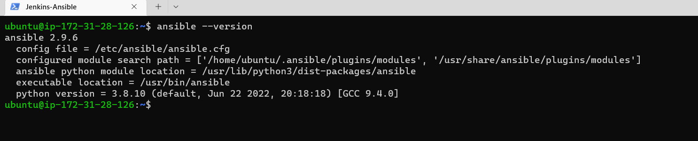

# ANSIBLE CONFIGURATION MANAGEMENT

## Install and configure Ansible client to act as a Jump Server/Bastion Host

Install and configure Ansible client to act as a Jump Server/Bastion Host. To do this, `Jenkins` EC2 instance is updated to `Jenkins-Ansible`


In GitHub create a new repository and name it `ansible-config-mgt`

Install Ansible on jenkins-ansible:

`sudo apt update`

`sudo apt install ansible`


Confirm Ansible version:

`ansible --version`



Create a new Freestyle project ansible in Jenkins and point it to ‘ansible-config-mgt’ repository:


Configure Webhook in GitHub and set webhook to trigger ansible build:


Configure build trigger to GitHub hook trigger for GITScm polling and a Post-build job to save all files (**):


Make sure to use `/main` branch not master:


Test setup by making some change in README.MD file in main branch and make sure that builds starts automatically and Jenkins saves the files:

`ls /var/lib/jenkins/jobs/ansible/builds/<build_number>/archive/`


Note: Allocate Elastic IP to Jenkins- Ansible Server and update github webhook with elastic IP

## Prepare your development environment using Visual Studio Code

Configured VSC to connect to the newly created github repository and ssh into the EC2 instances


Ansible uses TCP port 22 by default,which means it needs to ssh into target servers. Add privatekey.pem file to ssh agent. To apply this on a windows OS this tutorial was followed:

https://www.youtube.com/watch?v=OplGrY74qog

`ssh-add <path-to-private-key>`

Confirm the key has been added with the command below, you should see the name of your key:

`ssh-add -l`

## Ansible Development

In your `ansible-config-mgt` GitHub repository, create a new branch that will be used for development of a new feature:


Checkout the newly created feature branch to local machine and start building code and directory structure by:

Creating directory and name it `playbooks` with a new file called `common.yml` to be first playbook

Creating a directory and name it `invertory` to keep hosts organised. Within that directory, create inventory files: `dev.yml`, `staging.yml`, `uat.yml`, `prod.yml`


Update inventory/dev.yml file with code:
```
[nfs]
<NFS-Server-Private-IP-Address> ansible_ssh_user='ec2-user'

[webservers]
<Web-Server1-Private-IP-Address> ansible_ssh_user='ec2-user'
<Web-Server2-Private-IP-Address> ansible_ssh_user='ec2-user'

[db]
<Database-Private-IP-Address> ansible_ssh_user='ec2-user' 

[lb]
<Load-Balancer-Private-IP-Address> ansible_ssh_user='ubuntu'

```


In common.yml playbook configuration for repeatable, re-usable, and multi-machine tasks that is common to systems within the infrastructure will be written. Update playbooks/common.yml with code:

```
---
- name: update web, nfs and db servers
  hosts: webservers, nfs, db
  remote_user: ec2-user
  become: yes
  become_user: root
  tasks:
    - name: ensure wireshark is at the latest version
      yum:
        name: wireshark
        state: latest

- name: update LB server
  hosts: lb
  remote_user: ubuntu
  become: yes
  become_user: root
  tasks:
    - name: Update apt repo
      apt: 
        update_cache: yes

    - name: ensure wireshark is at the latest version
      apt:
        name: wireshark
        state: latest
  ```


## Commit Code To Github

Use git commands to add, commit and push your branch to GitHub. However in this project, vscode was used to perform those commands:


Create a Pull request for branch:


Merge those changes into the main branch:


Once code changes appear in master branch – Jenkins will do its job and save all the files (build artifacts) to /var/lib/jenkins/jobs/ansible/builds/<build_number>/archive/ directory on Jenkins-Ansible server:


Now run first Ansible test after cloning repo into Jenkins-Ansible server and pulling latest changes:

`cd ansible-config-mgt`
`ansible-playbook -i inventory/dev.yml playbooks/common.yml`


As shown in the image above, the db server was unreachable. After some digging, the issue was that the db server was ubuntu and did not match the RH configuration in dev.yml and common.yml. Therefore after correcting that, the image below shows ots successful:


To verify, go to each of the servers and check if wireshark has been installed with `which wireshark` or `wireshark --version`:


